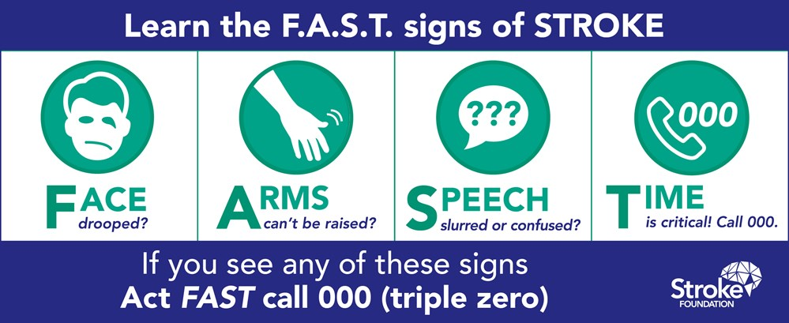

# k-nearest neighbors

# What you will learn

-   Concepts for "lazy learners" classifiers
-   How to easure similarity using distance
-   Demo: cancer classification using R
-   Exercises in GitHub as Org-mode file
-   Solutions in GitHub as PDF files

The basic idea of this class of "lazy learners" is that things are
alike are likely to have properties that are alike.

ML uses this principle to classify data by placing it in the same
category as similar, or "nearest" neighbors.

# Nearest neighbor classification

-   Classify unlabeled examples by assigning similar labeled examples
-   Human examples: reading, eating, meeting
-   Simple but powerful methods

With nearest-neighbor classification, computers apply a human-like
ability to recall past experiences to make conclusions about current
circumstances. Human examples:

<ul class="org-ul">
<li>Reading: making sense of sentences and words by context.</li>
<li>Eating: "dark restaurants" where you are totally blind</li>
<li>Meeting: making connections based on who's next to whom</li>
</ul>

## Nearest-neighbor appliations

-   Computer vision and facial recognition
-   Recommender systems
-   Genetic data pattern matching

<ul class="org-ul">
<li>Computer vision applications, including optical character
recognition and facial recognition in both still images and video</li>
<li>Recommendation systems that predict whether a person will enjoy a
movie or song</li>
<li>Identifying patterns in genetic data to detect specific proteins or
diseases</li>
</ul>

## Applicability

-   Features related in complex ways
-   Similar items homogeneous
-   "You know it when you see it"

Well suited for classification tasks where relationships among the
features and the target classes are numerous, complicated, or
otherwise extremely difficult to understand, yet the items of similar
class type tend to be fairly homogeneous.

if a concept is difficult to define, but <b>you know it when you see it</b>,
then nearest neighbors might be appropriate. On the other hand, if the
data is noisy and thus no clear distinction exists among the groups,
nearest neighbor algorithms may struggle to identify the class
boundaries.

# The `k`-NN algorithm

1.  Pick number of nearest neighbors k
2.  Use labeled training data set
3.  Identify k nearest records in test data
4.  Assign class to unlabeled test instance

<ul class="org-ul">
<li>k-NN uses information about a sample's k nearest neigbors to
classify unlabeled examples</li>
<li>k is the number of nearest neighbors (could be any number)</li>
<li>After choosing k, use training set labeled by nominal variable</li>
<li>For each unlabeled record in test set, k-NN identifies similar
records</li>
<li>Unlabeled test instance is assigned the majority class</li>
</ul>

## Workflow

Classification with the "trained" model:

<ul class="org-ul">
<li>Calculate distances to all other points (records)</li>
<li>Rank points according to k</li>
<li>Vote: Put test record into majority class</li>
</ul>

## Example: blind tasting

<ul class="org-ul">
<li>We want to predict/classify food that we cannot see based on
similarity to other foods.</li>
<li>Prior to eating we recorded previously-tasted ingredients.</li>
<li>We rated two features of each ingredient from 1 to 10.</li>
<li>We labeled each ingredient as one of 3 food types.</li>
</ul>

## Training: feature space

<ul class="org-ul">
<li>The k-NN algorithm treats the features as coordinates in a
multi-dimensional <b>feature space</b>. In our example: d=2.</li>
<li>To plot features, we use a <b>scatterplot</b> crunchiness vs. sweetness</li>
<li>The plot shows this after adding a few more ingredients</li>
<li>constructing the dataset in this way is the "training"</li>
</ul>

## Patterns in feature space

Similar types of food are grouped closely together:

<ul class="org-ul">
<li>Vegetables are crunchy but not sweet</li>
<li>Fruits are sweet and either crunchy or not crunchy</li>
<li>Proteins are neither crunchy nor sweet</li>
</ul>

## Testing: label instances

<ul class="org-ul">
<li>Locating the tomato's nearest neighbors requires a <b>distance function</b></li>
<li>A distance function measures the "similarity" between two instances</li>
<li>Traditionally, k-NN uses <b>Euclidean distance</b>, measuring "by ruler"</li>
<li>Other common measures: check out <code>help(dist)</code></li>
</ul>

## Euclidean distance

-   p, q: examples to be compared
-   1..n: example features

## Calculate distances

-   1-NN: "The tomato is a fruit"
-   2-NN: "The tomato is a fruit or a protein"
-   3-NN: "The tomato is a fruit"

To classify the tomato as a vegetable, protein, or fruit, we'll begin
by assigning the tomato the food type of its single nearest
neighbor. This is called 1-NN classification because k = 1. The orange
is the single nearest neighbor to the tomato, with a distance of
1.4. As orange is a fruit, the 1-NN algorithm would classify a tomato
as a fruit.

Using k=2 creates unclear decision boundaries. There is no winner.

If we use the k-NN algorithm with k = 3 instead, it performs a vote
among the three nearest neighbors: orange, grape, and nuts. Now,
because the majority class among these neighbors is fruit (two of the
three votes), the tomato again is classified as a fruit.

## Choice of k

## Data preparation

## Dummy coding

## Why is k-NN "lazy learning"?

## Strengths and Weaknesses

<table border="2" cellspacing="0" cellpadding="6" rules="groups" frame="hsides">

<colgroup>
<col  class="org-left" />

<col  class="org-left" />
</colgroup>
<tbody>
<tr>
<td class="org-left">STRENGTHS</td>
<td class="org-left">WEAKNESSES</td>
</tr>

<tr>
<td class="org-left">Simple and effective</td>
<td class="org-left">No model</td>
</tr>

<tr>
<td class="org-left">No assumptions</td>
<td class="org-left">Selection of k</td>
</tr>

<tr>
<td class="org-left">Fast training</td>
<td class="org-left">Slow classification</td>
</tr>

<tr>
<td class="org-left">&#xa0;</td>
<td class="org-left">Additional processing</td>
</tr>
</tbody>
</table>

<table border="2" cellspacing="0" cellpadding="6" rules="groups" frame="hsides">

<colgroup>
<col  class="org-left" />

<col  class="org-left" />
</colgroup>
<tbody>
<tr>
<td class="org-left">Simple and effective</td>
<td class="org-left">Does not produce a model, limiting the ability to understand how the features are related to the class</td>
</tr>

<tr>
<td class="org-left">Makes no assumptions about the underlying data distribution</td>
<td class="org-left">Requires selection of an appropriate k</td>
</tr>

<tr>
<td class="org-left">Fast training phase</td>
<td class="org-left">Slow classification phase</td>
</tr>

<tr>
<td class="org-left">&#xa0;</td>
<td class="org-left">Nominal features and missing data require additional processing</td>
</tr>
</tbody>
</table>

# Summary

# Glossary of concepts

# Glossary of code

# References

-   `4_knn.jpg`: Photo by Beth Macdonald on Unsplash.
-   `4_darkrestaurant.png`: [Patrons at the Whale Inside Dark Restaurant](https://www.nytimes.com/2007/07/22/travel/22surfacing.html).
-   `4_nn_applications.jpg`: Photo by George Prentzas on Unsplash.
-   `4_knn_cat_dog.png`, `4_knn_algorithm.png` - Christopher (Feb 2, 2021).

-   Lantz (2019). Machine Learning with R (3e). Packt.
-   Christopher (2021). K-Nearest Neighbor. [URL: medium.com](https://medium.com/swlh/k-nearest-neighbor-ca2593d7a3c4).

