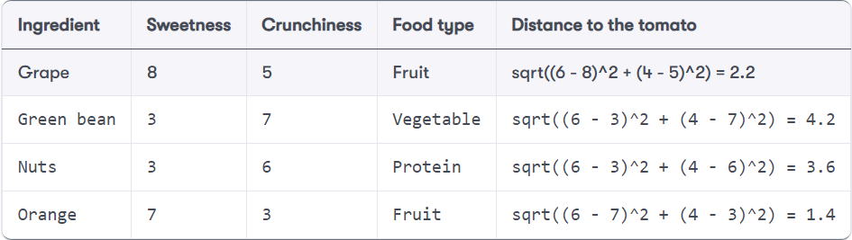

# k-nearest neighbors

-   Lecture notes in Markdown file (`4_knn.md`)
-   Source: Lantz (2019), chapter 3, pp. 65-89
-   See also: DataCamp assignment chapter 1

# What you will learn

-   Concepts for "lazy learners" classifiers
-   How to easure similarity using distance
-   Demo: cancer classification using R
-   Exercises in GitHub as Org-mode file
-   Solutions in GitHub as PDF files

The basic idea of this class of "lazy learners" is that things that
are alike are likely to have properties that are alike.

ML uses this principle to classify data by placing it in the same
category as similar, or "nearest" neighbors.

The choice of similarity measure and the choice of the parameter k are
crucial.

# Nearest neighbor classification

-   Classify unlabeled (unknown) examples
-   Assign similar labeled (known) examples
-   Human examples: reading, eating, meeting
-   Simple but powerful methods

Remember our terminology:

<ol class="org-ol">
<li>Unit of observation, e.g. email/patients</li>
<li>Examples or instances, e.g. message/patient sample</li>
<li>Features: e.g. words/characteristics of message/patient</li>
</ol>

With nearest-neighbor classification, computers apply a human-like
ability to recall past experiences to make conclusions about current
circumstances. Human examples:

<ul class="org-ul">
<li>Reading: making sense of sentences and words by context.</li>
<li>Eating: "dark restaurants" where you are totally blind</li>
<li>Meeting: making connections based on who's next to whom</li>
</ul>

## Nearest-neighbor applications

-   Computer vision and facial recognition
-   Recommender systems
-   Genetic data pattern matching

<ul class="org-ul">
<li>Computer vision applications, including optical character
recognition and facial recognition in both still images and video</li>
<li>Recommendation systems that predict whether a person will enjoy a
movie or song</li>
<li>Identifying patterns in genetic data to detect specific proteins or
diseases</li>
</ul>

## Applicability

-   Features related in complex ways
-   Similar items homogeneous
-   "You know it when you see it"

Well suited for classification tasks where relationships among the
features and the target classes are <b>numerous</b>, <b>complicated</b>, or
otherwise extremely <b>difficult to understand</b>, yet the items of similar
class type tend to be fairly homogeneous.

E.g. a <b>stroke event</b>: unit of observation = person, example = a person
with a problem, features: face, arms and speech symptomps. Note that
we could also treat the "stroke prediction" with decision trees.

If a concept is difficult to define, but <b>you know it when you see it</b>,
then nearest neighbors might be appropriate. On the other hand, if the
data is <b>noisy</b> and thus no clear distinction exists among the groups,
nearest neighbor algorithms may struggle to identify the class
boundaries.

# The `k`-NN algorithm

1.  Pick number of nearest neighbors k
2.  Use labeled training data set
3.  Identify k nearest records in test data
4.  Assign class to unlabeled test instance

<ul class="org-ul">
<li>k-NN uses information about a sample's k nearest neigbors to
classify unlabeled examples</li>
<li>k is the number of nearest neighbors (could be any number)</li>
<li>After choosing k, use training set labeled by nominal categorical
variables (the classes or groups to choose from)</li>
<li>For each unlabeled record in test set, k-NN identifies similar
records</li>
<li>Unlabeled test instance is assigned the majority class</li>
</ul>

## Workflow

Classification with the "trained" model:

<ul class="org-ul">
<li>Calculate distances to all other points (records)</li>
<li>Rank points according to k</li>
<li>Vote: Put test record into majority class</li>
</ul>

## Example: blind tasting

<ul class="org-ul">
<li>We want to predict/classify food that we cannot see based on
similarity to other foods.</li>
<li>Prior to eating we recorded previously-tasted ingredients.</li>
<li>We rated two features of each ingredient from 1 to 10.</li>
<li>We labeled each ingredient as one of 3 food types.</li>
</ul>

This is just like the "workflow" example shown before - instead of
three color classes, we now have three food type classes, protein,
fruit and vegetable.

## Training: feature space

<ul class="org-ul">
<li>The k-NN algorithm treats the features as coordinates in a
multi-dimensional <b>feature space</b>.</li>
<li>Visualized in our example: d=2 with a few more features added.</li>
<li>What kind of plot is this? A <b>scatterplot</b>!</li>
<li>To plot features, which are column vectors in our table, we use a
<b>scatterplot</b> of crunchiness vs. sweetness</li>
<li>Constructing the dataset in this way is part of the <b>"training"</b>:
building a feature space of known, labeled features for
classification of unlabeled, unknown features.</li>
<li>Our third feature, the <b>food type</b> is the class for classification.</li>
</ul>

## Training: feature patterns

The third feature is represented here as a grouping - when plotting
this in R, how would you represent it?

Answer: as a factor vector with three (nominal) levels, vegetables,
fruits, and proteins. In the plot, you could color the groups
according to this category (we'll plot an example later).

Similar types of food are grouped closely together:

<ul class="org-ul">
<li>Vegetables are crunchy but not sweet</li>
<li>Fruits are sweet and either crunchy or not crunchy</li>
<li>Proteins are neither crunchy nor sweet</li>
</ul>

## Testing: label examples

<ul class="org-ul">
<li>Locating the tomato's nearest neighbors requires a <b>distance function</b></li>
<li>The tomato sits conveniently between our classes.</li>
<li>A distance function measures the "similarity" between two instances</li>
<li>Traditionally, k-NN uses <b>Euclidean distance</b>, measuring "by ruler"</li>
<li>Other common measures: check out <code>help(dist)</code>, which lists 6 different
types.</li>
</ul>

## Euclidean distance

-   $p$, $q$: examples to be compared
-   e.g. p=tomato, q=grape
-   $1...n$: example features
-   e.g. $1$ = sweetness, $2$ = crunchiness

<ul class="org-ul">
<li>The general formula allows for $n$-dimensional feature vectors.</li>
<li>In our food example, \(p\) corresponds to the tomato, and \(q\) to any
other labeled object, e.g. a grape, a green bean etc.</li>
<li>The index corresponds to the recorded features with whom the
examples were labeled: here, we only have d=2, sweetness and
crunchiness.</li>
<li>The last formula shows the computed Euclidean distance for the
tomato and the green bean examples.</li>
</ul>

## Calculate distances

-   1-NN: "The tomato is a fruit"
-   2-NN: "The tomato is a fruit or a protein"
-   3-NN: "The tomato is a fruit"

To classify the tomato as a vegetable, protein, or fruit, we'll begin
by assigning the tomato the food type of its single nearest
neighbor. This is called 1-NN classification because k = 1. The <b>orange</b>
is the single nearest neighbor to the tomato, with a distance of
1.4. As orange is a fruit, the 1-NN algorithm would classify a tomato
as a fruit.

Using k=2 creates unclear decision boundaries. There is no winner
between orange and nuts.

If we use the k-NN algorithm with k = 3 instead, it performs a vote
among the three nearest neighbors: orange, grape, and nuts. Now,
because the majority class among these neighbors is fruit (two of the
three votes), the tomato again is classified as a <b>fruit</b>.

## Underfitting vs. overfitting

Underfitting | Perfect fit | Overfitting

In the image (by Viktor Lavrenko, 2014), the "predictor" is the set of
features used for prediction of the trend line (in the regression
example), and for the prediction of the two classes.

<ul class="org-ul">
<li><b>Underfitting:</b> boundary ignores points. Points do not clearly fall on
either side of the line. Both training and test data have large
errors.</li>
<li><b>Perfect fit:</b> the line segments the classes clearly - only a couple
of noisy examples contaminate it and can be identified by distance
from the line.</li>
<li><b>Overfitting:</b> noise data dominate the classification. The test data
error will be large while the training data error is small.</li>
</ul>

## Choice of k

-   $k$ determines performance on future data
-   Danger of underfitting or overfitting
-   "Bias-variance" tradeoff

<ul class="org-ul">
<li><b>Underfitting:</b> boundaries do not capture many relationships well -
high error rate = large k (large neighborhood) ignores samples</li>
<li><b>Overfitting</b>: class boundaries too small, local neighborhoods
dominate.</li>
<li><b>"Bias-variance" tradeoff</b>: large k reduces the impact of variance
(data spread) caused by noisy data but can bias the learner so that
small but important patterns are ignored.</li>
<li><b>Very large k</b>: then the majority class would always dominate the
voting regardless of the nearest neighbors.</li>
<li><b>Very small k</b>: now nearest neighbors dominate even if they
are just noise - e.g. <b>mislabeled</b> data - see English corpus</li>
</ul>

## Data preparation

min-max normalization

z-score standardization

<ul class="org-ul">
<li>The distance formula depends on the range: if you add a feature with
a large scale, it will dominate the results (e.g. "spiciness" via
Scoville scale - differences are much greater than sweet/crunchy).</li>
<li>Rescale features to equal scales with min-max normalization (all
values in 0 to 1) = how far (0 to 100%) did the original value fall
along the original data range?</li>
<li>z-score standardization: how many standard deviations (distance from
the mean) do data fall above or below the mean? Unlike the normal
distribution, the values are unbounded.</li>
<li>Rescaling must be applied to training and test data (tricky - might
be out of range - you may not know the maximum or minimum).</li>
</ul>

## Dummy coding

2-category (binary) variable (male, female)

3-category variable (hot, medium, cold)

<ul class="org-ul">
<li>Euclidean distance is not defined for nominal <code>categorical</code> data
("characters") - need to convert data to <code>numeric</code> format.</li>
<li><b>Dummy coding</b> = split category set in binary values, if the values
are exclusive (like <code>male</code> vs <code>female</code>).</li>
<li>An n-category nominal feature can be dummy coded by creating binary
indicator variables for n-1 levels of the feature.</li>
<li>Example: knowing that <code>hot</code> and <code>medium</code> are both <code>0</code> means that <code>cold</code> is
<code>1</code> - it it's not hot or medium, it must be cold.</li>
<li>Dummy coded data always fall on 0 or 1, so there is no need for
min-max normalization.</li>
<li>Ordinal categorical data could be numbered: this works only if the
steps between categories are equivalent, e.g. "lower", "middle",
"upper" class - distance between them not equal.</li>
</ul>

## Why is k-NN "lazy learning"?

-   k-NN has no generalization/abstraction
-   Data are stored verbatim (rapid training)
-   Test/production relies on training data (slow)

<ul class="org-ul">
<li>Abstraction is minimal - no detail is suppressed.</li>
<li>Generalization (imposing rules) is not there at all.</li>
<li>The training consists in putting the data together.</li>
<li>The testing uses all training data so it can be slow.</li>
</ul>

## Rote learning

-   Instance-based learners build no models
-   Non-parametric methods learn no parameters
-   Rote learners find natural bias-free patterns

<ul class="org-ul">
<li>Alternative name: instance-based learners</li>
<li>No model is built, no parameters are learnt</li>
<li>We do not really understand how the classifier uses the data</li>
<li>Instead, everything depends on choice of k and choice of similarity
measure</li>
<li>Upside: the learner can find "natural" patterns rather than trying
to fit the data into a biased and potentially flawed functional form.</li>
</ul>

# Strengths and Weaknesses

<table border="2" cellspacing="0" cellpadding="6" rules="groups" frame="hsides">

<colgroup>
<col  class="org-left" />

<col  class="org-left" />
</colgroup>
<tbody>
<tr>
<td class="org-left">STRENGTHS</td>
<td class="org-left">WEAKNESSES</td>
</tr>

<tr>
<td class="org-left">Simple and effective</td>
<td class="org-left">No model</td>
</tr>

<tr>
<td class="org-left">No assumptions</td>
<td class="org-left">Selection of k</td>
</tr>

<tr>
<td class="org-left">Fast training</td>
<td class="org-left">Slow classification</td>
</tr>

<tr>
<td class="org-left">Natural, no bias</td>
<td class="org-left">Additional processing</td>
</tr>
</tbody>
</table>

STRENGTHS:

<ul class="org-ul">
<li>Simple and effective: Does not produce a model, limiting the ability
to understand how the features are related to the class</li>
<li>Makes no assumptions about the underlying data distribution:
bias-free, favors natural patterns</li>
<li>Fast training phase since generalization (finding rules) is bypassed.</li>
</ul>

WEAKNESSES:

<ul class="org-ul">
<li>No model is being built (no mathematical analysis of the model)</li>
<li>Requires selection of an appropriate k - dangers of over- or underfitting</li>
<li>Slow classification phase because all training data instances are used</li>
<li>Nominal features and missing data require additional processing,
e.g. min-max normalization or z-score standardization</li>
</ul>

# Summary

-   k-nearest neighbors does no learning at all
-   k-NN stores training data, matches test data to most similar records
    in training set using a distance function
-   Unlabeled example is assigned neighbor's label
-   Though simple, k-NN performs well for extremely complex tasks

# References

-   `4_knn.jpg`: Photo by Beth Macdonald on Unsplash.
-   `4_darkrestaurant.png`: [Patrons at the Whale Inside Dark Restaurant](https://www.nytimes.com/2007/07/22/travel/22surfacing.html).
-   `4_nn_applications.jpg`: Photo by George Prentzas on Unsplash.
-   `4_knn_cat_dog.png`, `4_knn_algorithm.png` - Christopher (Feb 2, 2021).

-   Lantz (2019). Machine Learning with R (3e). Packt.
-   Christopher (2021). K-Nearest Neighbor. [URL: medium.com](https://medium.com/swlh/k-nearest-neighbor-ca2593d7a3c4).

