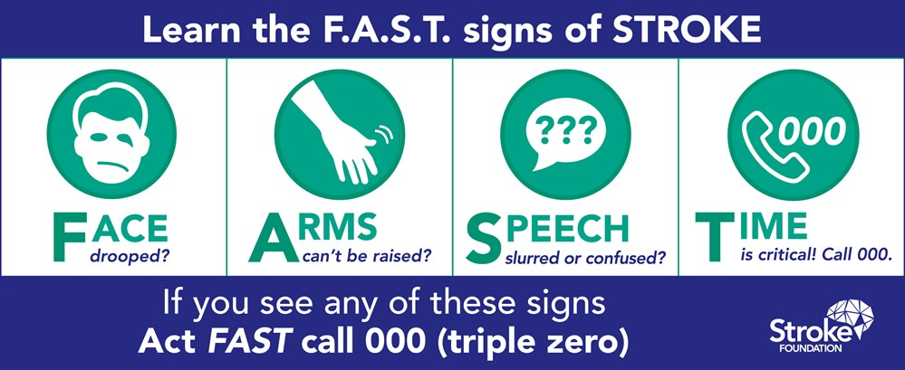

# k-nearest neighbors

# What you will learn

-   Concepts for "lazy learners" classifiers

-   How to easure similarity using distance

-   Demo: cancer classification using R

-   Practice file in GitHub as Org-files

-   Solutions in GitHub as PDF files

The basic idea of this class of "lazy learners" is that things are
alike are likely to have properties that are alike.

ML uses this principle to classify data by placing it in the same
category as similar, or "nearest" neighbors.

# Nearest neighbor classification

-   Classify unlabeled examples by assigning similar labeled examples
-   Human examples: reading, eating, meeting
-   Simple but powerful methods

With nearest-neighbor classification, computers apply a human-like
ability to recall past experiences to make conclusions about current
circumstances. Human examples:

<ul class="org-ul">
<li>Reading: making sense of sentences and words by context.</li>
<li>Eating: "dark restaurants" where you are totally blind</li>
<li>Meeting: making connections based on who's next to whom</li>
</ul>

## Nearest-neighbor appliations

-   Computer vision and facial recognition
-   Recommender systems
-   Genetic data pattern matching

<ul class="org-ul">
<li>Computer vision applications, including optical character
recognition and facial recognition in both still images and video</li>
<li>Recommendation systems that predict whether a person will enjoy a
movie or song</li>
<li>Identifying patterns in genetic data to detect specific proteins or
diseases</li>
</ul>

## Applicability

-   Features related in complex ways
-   Similar items homogeneous
-   "You know it when you see it"

Well suited for classification tasks where relationships among the
features and the target classes are numerous, complicated, or
otherwise extremely difficult to understand, yet the items of similar
class type tend to be fairly homogeneous.

if a concept is difficult to define, but <b>you know it when you see it</b>,
then nearest neighbors might be appropriate. On the other hand, if the
data is noisy and thus no clear distinction exists among the groups,
nearest neighbor algorithms may struggle to identify the class
boundaries.

## The `k`-NN algorithm

<table border="2" cellspacing="0" cellpadding="6" rules="groups" frame="hsides">

<colgroup>
<col  class="org-left" />

<col  class="org-left" />
</colgroup>
<tbody>
<tr>
<td class="org-left">STRENGTHS</td>
<td class="org-left">WEAKNESSES</td>
</tr>

<tr>
<td class="org-left">Simple and effective</td>
<td class="org-left">No model</td>
</tr>

<tr>
<td class="org-left">No assumptions</td>
<td class="org-left">Selection of k</td>
</tr>

<tr>
<td class="org-left">Fast training</td>
<td class="org-left">Slow classification</td>
</tr>

<tr>
<td class="org-left">&#xa0;</td>
<td class="org-left">Additional processing</td>
</tr>
</tbody>
</table>

<table border="2" cellspacing="0" cellpadding="6" rules="groups" frame="hsides">

<colgroup>
<col  class="org-left" />

<col  class="org-left" />
</colgroup>
<tbody>
<tr>
<td class="org-left">Simple and effective</td>
<td class="org-left">Does not produce a model, limiting the ability to understand how the features are related to the class</td>
</tr>

<tr>
<td class="org-left">Makes no assumptions about the underlying data distribution</td>
<td class="org-left">Requires selection of an appropriate k</td>
</tr>

<tr>
<td class="org-left">Fast training phase</td>
<td class="org-left">Slow classification phase</td>
</tr>

<tr>
<td class="org-left">&#xa0;</td>
<td class="org-left">Nominal features and missing data require additional processing</td>
</tr>
</tbody>
</table>

<ul class="org-ul">
<li>k-NN uses information about a sample's k nearest neigbors to
classify unlabeled examples</li>
<li>k is the number of nearest neighbors (could be any number)</li>
</ul>

# SUMMARY

# GLOSSARY OF CONCEPTS

# GLOSSARY OF CODE

# REFERENCES

-   `4_knn.jpg`: Photo by Beth Macdonald on Unsplash.
-   `4_darkrestaurant.png`: [Patrons at the Whale Inside Dark Restaurant](https://www.nytimes.com/2007/07/22/travel/22surfacing.html).
-   `4_nn_applications.jpg`: Photo by George Prentzas on Unsplash.
-   Lantz (2019). Machine Learning with R (3e). Packt.

